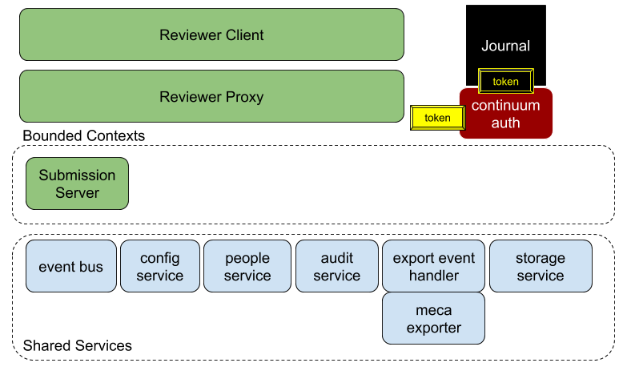

# Architecture

The architecture is a standard microservices based architecture which is explained throughout this book. Below is diagram that shows the salient features, these are:

* _**Separation of the domain from the supporting services**_
  * The "domain" being publishing, currently only the [bounded context](https://martinfowler.com/bliki/BoundedContext.html) of "Submission" is being implemented.
* _**Supporting Services**_
  * **Event bus,** this has the responsibility for handling messages between various components in the system. It has been written using abstract interfaces so that support can be added for other implementations. Currently, only [RabbitMQ](https://www.rabbitmq.com/) has been implemented.
  * **Config Service**, TBD - The responsibility is to handle the configuration and communication within the system.
  * **People Service**, TBD - The responsibility is manage users and roles within the system.
  * **Audit Service**, this has the responsibility for listening for any domain events events and logging them within the database. Examples of such events are: logging in, uploading or submitting a manuscript, etc.
  * **Export Event Handler,** TBD - The responsibility is to determine which type of export is required and routing the correct message to the correct export handler such as the "**Meca Exporter**"
  * **Storage Service**, TBD - The responsibility is to handle all files within the system.

[Link to Diagram Source](https://docs.google.com/drawings/d/1Z2jY0VaifU7g_iD9KXedHcyW-SFhIv7n4Vt23TLOZ9c/view)

